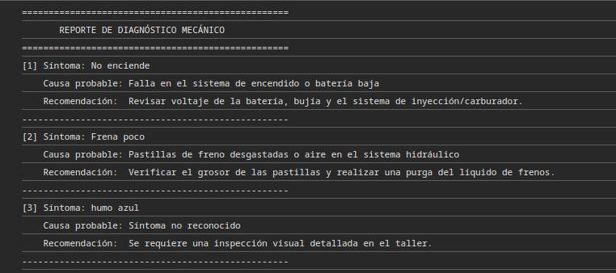

# ⚔️  Sistema para diagnostico rápido de mecánica.
###  Tabla con sintomas y las posibles soluciones.

* **Alumno:** Lester Garcia
* **Proyecto** Diagnostico rápido de mecanica..
* **Lenguaje:** JavaScript (ES6+)

### Evidencia:

La tabla representa el reporte de diagnostico, donde apartir de la causa surge la recomendacion.

